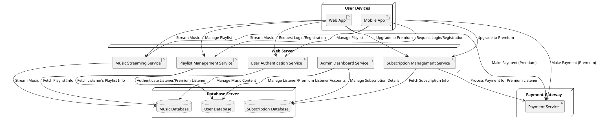

```plantuml
@startuml
node "User Devices" {
  artifact "Mobile App" as mobileApp
  artifact "Web App" as webApp
}

node "Web Server" {
  artifact "User Authentication Service" as authService
  artifact "Playlist Management Service" as playlistService
  artifact "Music Streaming Service" as streamingService
  artifact "Subscription Management Service" as subscriptionService
  artifact "Admin Dashboard Service" as adminService
}

node "Database Server" {
  database "User Database" as userDB
  database "Music Database" as musicDB
  database "Subscription Database" as subscriptionDB
}

node "Payment Gateway" {
  artifact "Payment Service" as paymentService
}

mobileApp --> authService : "Request Login/Registration"
mobileApp --> playlistService : "Manage Playlist"
mobileApp --> streamingService : "Stream Music"
mobileApp --> subscriptionService : "Upgrade to Premium"
mobileApp --> paymentService : "Make Payment (Premium)"

webApp --> authService : "Request Login/Registration"
webApp --> playlistService : "Manage Playlist"
webApp --> streamingService : "Stream Music"
webApp --> subscriptionService : "Upgrade to Premium"
webApp --> paymentService : "Make Payment (Premium)"

authService --> userDB : "Authenticate Listener/Premium Listener"
playlistService --> musicDB : "Fetch Playlist Info"
playlistService --> userDB : "Fetch Listener's Playlist Info"
streamingService --> musicDB : "Stream Music"

subscriptionService --> subscriptionDB : "Fetch Subscription Info"
subscriptionService --> paymentService : "Process Payment for Premium Listener"
adminService --> userDB : "Manage Listener/Premium Listener Accounts"
adminService --> musicDB : "Manage Music Content"
adminService --> subscriptionDB : "Manage Subscription Details"

@enduml
```
