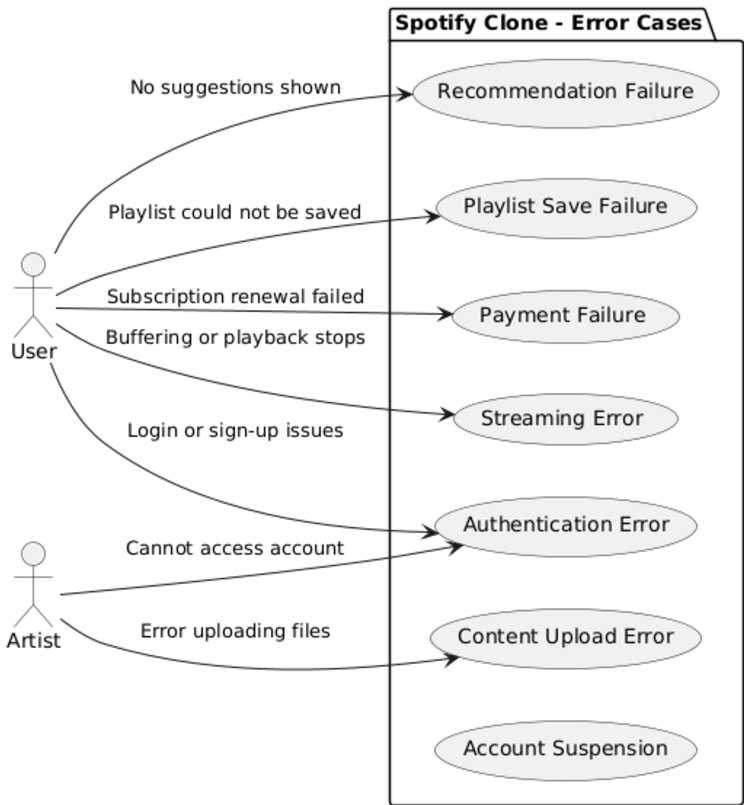

# **1. Software Requirements Specification (SRS)**

## Project Title: **Spotify Competitor**

### Version: 1.0

---

## 1. Introduction

### 1.1 Purpose

The purpose of this Software Requirements Specification (SRS) document is to provide a detailed and technical description of the Spotify Clone, a music streaming platform designed for local artists. The system is intended to enable authenticated users to stream music, create and manage playlists, follow artists, and discover music based on regional preferences.

### 1.2 Scope

The Spotify Clone will deliver a seamless music streaming experience on web and mobile platforms. It is designed for diverse user roles, including listeners, artists, and premium subscribers. Core functionalities include user authentication, real-time streaming, playlist management, personalized recommendations, offline playback for premium users, and secure payment processing for subscriptions.

### 1.3 Definitions, Acronyms, and Abbreviations

- **API**: Application Programming Interface  
- **UI**: User Interface  
- **UX**: User Experience  
- **SRS**: Software Requirements Specification  
- **OAuth 2.0**: Open Authorization, a protocol for secure user authentication  
- **SSL**: Secure Sockets Layer, a protocol for encrypted communications  

### 1.4 Overview

This document provides a roadmap for designing and implementing a music streaming platform with features like secure authentication, playlist management, and personalized recommendations. Key non-functional requirements, design constraints, and interfaces are outlined to guide development. The solution focuses on scalability, modularity, and performance to cater to a large user base.

---

## 2. Overall Description

### 2.1 Product Perspective

The Spotify Clone is a multi-platform music streaming application that uses third-party APIs for metadata management. It allows authenticated users to stream music, create playlists, and explore new content. The system emphasizes scalability and modularity to ensure performance under heavy user loads.

### 2.2 Product Functions

- **Authentication**: Registration and login using email or OAuth 2.0 for secure access.  
- **Streaming**: Real-time music playback with high-quality audio options.  
- **Playlist Management**: Allows creation, modification, and deletion of playlists.  
- **Music Search**: Keyword-based search for songs, albums, and artists.  
- **Personalized Recommendations**: Dynamic recommendations based on user activity.  
- **Offline Playback**: Premium subscribers can download songs for offline access.  
- **Subscription Management**: Handles payment processing, renewal, and cancellations.  

### 2.3 User Classes and Characteristics

- **Basic Listener**: Newly registered individuals who access the platform with limited features and advertisements.  
- **Premium Subscriber**: Advanced users with paid subscriptions, enjoying ad-free listening, offline downloads, and high-quality audio.  
- **Artist**: Contributors who upload and manage music, track engagement metrics, and interact with followers.  
- **Administrator**: Privileged users responsible for monitoring content, managing user accounts, and ensuring compliance.  

### 2.4 Operating Environment

- **Client-Side**: Modern web browsers (e.g., Chrome, Firefox) and mobile devices (iOS and Android).  
- **Server-Side**: Hosted on AWS, developed using Node.js, with REST APIs for data exchange.  
- **Database**: MongoDB for storing metadata, user information, and playlists.  

### 2.5 Design and Implementation Constraints

- The system must support responsive design for optimal performance on various devices.  
- Adherence to GDPR and other privacy regulations.  
- SSL encryption for secure audio streaming.  
- Real-time updates for playlist synchronization and user interactions.  

---

## 3. Requirements

### 3.1 Functional Requirements

| **Use Case**             | **Primary Actor** | **Preconditions**                     | **Actor's Goals**            | **Secondary Actors** | **Main Tasks/Functions**                   |
| ------------------------ | ----------------- | ------------------------------------- | ---------------------------- | -------------------- | ------------------------------------------ |
| Stream Music             | End User          | End User is logged in and has internet    | Listen to songs online       | None                 | Fetch and play music in real-time          |
| Download Offline Music   | Premium User      | Premium User is logged in with a premium plan | Listen to music offline      | None                 | Enable song downloads for offline access   |
| Generate Recommendations | End User          | End User has an active account            | Discover new music           | System Algorithm     | Suggest songs based on user's activity     |
| Report Issues            | End User          | End User encountered an issue             | Resolve app problems         | Admin                | Submit issue reports to support team       |
| Browse Music             | End User          | End User is logged in                     | Explore available songs      | None                 | Display categories and playlists           |
| Search for Songs         | End User          | End User is logged in                     | Find specific tracks         | None                 | Enable keyword-based song search           |
| Create Playlist          | End User          | End User is logged in                     | Organize favorite tracks     | None                 | Add/remove songs to/from playlists         |
| View Artist Analytics    | Artist            | Artist account is active              | Track performance of uploads | None                 | Show statistics on views and plays         |
| Upload Content           | Artist            | Artist account is active              | Share music with End Users       | Admin (approval)     | Upload and manage music files              |
| Handle Payments          | Admin             | Payment systems are set up            | Manage Premium User subscriptions    | End User                 | Process subscription fees and transactions |
| Manage Users             | Admin             | Admin account is active               | Maintain user database       | End User/Artist          | Add, remove, or modify user accounts       |
---
- **User**: Refers to any individual who interacts with the music streaming platform. It can be categorized as:
  - **End User**: A general user who accesses the platform for music streaming and related features.
  - **Premium User**: A subscriber with additional privileges like downloading music for offline listening.
  - **Artist**: A creator or contributor uploading content and managing their analytics.
  - **Admin**: A platform manager responsible for overseeing user accounts, handling payments, and maintaining the system.
---

### 3.2 Use Case Diagram

# Abuse Case Diagram

# Error Case Diagram

### 3.2 Non-Functional Requirements

| **SE Guidelines/NFRs** | **Performance** | **Security** | **Availability** | **Scalability** | **Usability** |
|-------------------------|-----------------|--------------|------------------|-----------------|---------------|
| **Modularity**          | C+              | C+           | C+               | C+              | O             |
| **Maintainability**     | O               | C+           | C+               | C+              | O             |
| **Reusability**         | O               | C+           | C+               | C+              | O             |
| **Testability**         | O               | C+           | C+               | O               | I             |
| **Documentation**       | I               | C+           | O                | O               | C+            |
| **Error Handling**      | C               | C+           | C+               | O               | C+            |

---

### Legend for Relationship Types:
- **C+**: Direct and positive contribution to NFR.  
- **C**: Compatible with additional considerations.  
- **O**: Optional, indirectly supports NFR.  
- **I**: Insufficient or unrelated to NFR.  

---

## 4. External Interface Requirements

### 4.1 User Interfaces

-   **Login Screen**: Includes forms for email or social login options.
-   **Music Player**: Displays current track details, playback controls (play, pause, skip), volume control, and playlist management.
-   **Search Interface**: A search bar with auto-suggestions and filtering options.
-   **Recommendations Interface**: A section displaying recommended songs, albums, and artists.

### 4.2 Hardware Interfaces

-   Devices with internet access and audio output, such as smartphones, tablets, and desktop computers.

### 4.3 Software Interfaces

-   **Spotify API**: For retrieving metadata about songs, albums, and artists.
-   **OAuth 2.0**: To handle secure user authentication.
-   **Payment Gateway**: Integration with services like Stripe or PayPal for managing premium subscriptions.

### 4.4 Communication Interfaces

-   The application should use HTTPS for secure communication between the client and server.
-   Real-time updates using WebSockets for seamless playlist synchronization.

### 4.5 Payment Gateway Interface

-   **Integration**: The system must integrate with third-party payment gateways (e.g. PayPal) for handling premium subscriptions.
-   **Payment Methods**: Support for various payment methods, including credit/debit cards, PayPal, and digital wallets.
-   **Security**: The interface must adhere to PCI-DSS compliance standards for secure transaction processing.
-   **Subscription Management**: Automatic subscription renewal with notifications for renewal dates and any issues related to payment failures.**A portion of premium subscription revenue will be directed towards supporting local artists as per the COPYRIGHT ROYALTY BOARD.**

-   **Refunds and Cancellations**: Users should be able to cancel subscriptions, with automated processing of refunds as per the platform's policies.

---

## 5. System Architecture

### 5.1 High-Level Architecture

The Spotify Clone will consist of the following components:

-   **Frontend**: A responsive web application developed using React, and a mobile app developed using React Native.
-   **Backend**: A RESTful API using Node.js and Express, responsible for handling business logic and database interactions.
-   **Database**: MongoDB for storing user information, playlists, and music metadata.
-   **Third-Party Services**: Integration with Spotify API, payment gateways, and analytics tools for tracking user engagement.

---

## 6. Future Enhancements

Potential future enhancements include:

-   Integration of live audio sessions and artist-hosted events.
-   Expanding language support for a global user base.
-   AI-based audio analysis for deeper personalization of recommendations.
-   Development of a dedicated mobile app for iOS and Android.

---

## 7. References

-   [Spotify API Documentation](https://developer.spotify.com/documentation/web-api/)
-   [Web Audio API](https://developer.mozilla.org/en-US/docs/Web/API/Web_Audio_API)
-   User surveys and feedback on music streaming experiences
-   Competitive analysis of existing platforms (e.g., Spotify, Apple Music)
-   classroom pdf-1

## Abuse case References
-   [Spotify's scam](https://qz.com/1212330/a-bulgarian-scheme-scammed-spotify-for-1-million-without-breaking-a-single-law)
